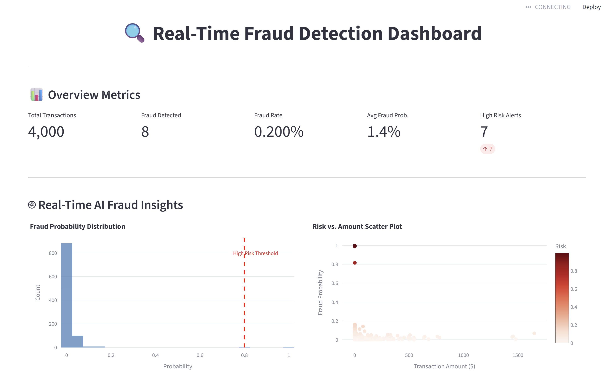
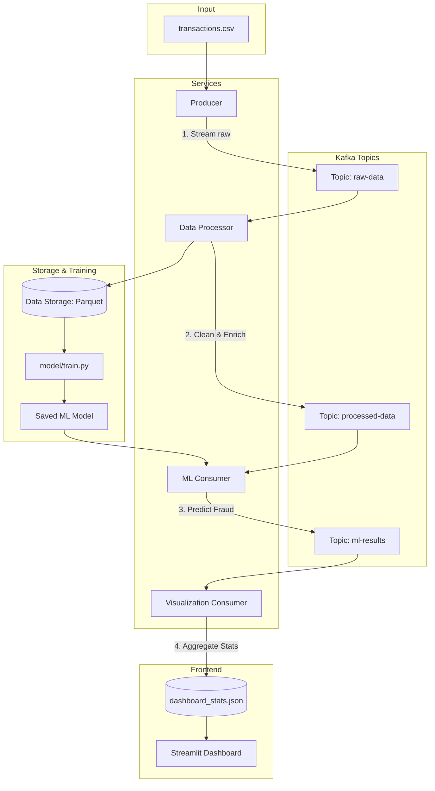

# Real-time Fraud Detection Pipeline with Kafka

Проект представляет собой конвейер обработки данных в реальном времени для обнаружения мошеннических транзакций (Fraud Detection) с использованием Apache Kafka, Python и машинного обучения.



## 🏗 Архитектура системы



### 🗺 Карта топиков и потоков данных

| Модуль | Читает из (Input) | Пишет в (Output) | Описание |
| :--- | :--- | :--- | :--- |
| **Producer** | `transactions.csv` | `raw-data` | Эмуляция потока сырых транзакций. |
| **Data Processor** | `raw-data` | `processed-data` | Очистка данных, приведение типов, сохранение в Parquet. |
| **ML Consumer** | `processed-data` | `ml-results` | Применение модели и классификация (Fraud/Legitimate). |
| **Visualization** | `ml-results` | `dashboard_stats.json` | Сбор метрик для отображения на дашборде, включая AI-инсайты. |

Система состоит из нескольких независимых сервисов:

1.  **Producer**: Стримит транзакции из CSV-датасета в топик `raw-data`. Поддерживает режим равномерного распределения фрод-транзакций (`--uniform-fraud`).
2.  **Data Processor Consumer**: Считывает сырые данные, выполняет базовую очистку и сохраняет их в формате Parquet для последующего анализа и дообучения моделей.
3.  **ML Consumer**: Применяет предобученную модель машинного обучения к потоку транзакций в реальном времени для классификации (Fraud / Legitimate). Обогащает данные оценкой вероятности фрода.
4.  **Visualization Consumer**: Считывает обогащенные ML-результаты, собирает метрики и подготавливает данные для отображения в реальном времени.
5.  **Dashboard (App)**: Интерфейс (Streamlit) для мониторинга потока транзакций и метрик безопасности.

## 📦 Модули

- `producer.py`: Эмулятор потока транзакций.
- `data_processor_consumer.py`: Сервис сохранения и предобработки данных.
- `ml_consumer.py`: Инференс модели в реальном времени.
- `visualization_consumer.py`: Обработка данных для визуализации.
- `app.py`: Веб-интерфейс мониторинга.
- `model/train.py`: Скрипт для обучения модели на исторических данных.

## 🖥 Интерфейс мониторинга (Dashboard)

Веб-интерфейс на базе **Streamlit** предоставляет визуализацию работы всего конвейера в реальном времени:

*   **Real-time AI Insights**: Анализ рисков в реальном времени, распределение вероятностей фрода и корреляция суммы транзакции с уровнем риска.
*   **Real-time Transactions**: Живая таблица последних обработанных транзакций с цветовой индикацией подозрительных операций (AI-prediction + Risk Score).
*   **Fraud Statistics**: Счетчики общего количества транзакций, выявленных случаев мошенничества, средней вероятности фрода и алерты высокого риска.
*   **Analytics Charts**:
    *   **Feature Analysis**: Гистограммы распределения сумм транзакций и анализ активности по времени суток (Normal vs Fraud).
    *   **Model Performance**: Метрики точности (Accuracy, ROC-AUC) и графики (ROC Curve, Confusion Matrix).

## 🧠 Машинное обучение (ML)

Для работы сервиса детекции мошенничества (`ml_consumer.py`) необходимо предварительно обучить модель на исторических данных.

1.  **Обучение модели**:
    ```bash
    $(PYTHON) model/train.py
    ```
    Скрипт выполнит предобработку данных, обучит классификатор и сохранит веса модели в директорию `model/saved/`.

2.  **Использование в консьюмере**:
    `ml_consumer.py` автоматически подхватит последнюю версию обученной модели из `model/saved/` при запуске.

## 🚀 Быстрый старт

### Предварительные требования

- Docker и Docker Compose
- Python 3.12+
- Менеджер пакетов `uv` (устанавливается автоматически при `make install`)

### Развертывание

1.  **Установка зависимостей и подготовка окружения**:
    ```bash
    make install
    ```

2.  **Запуск инфраструктуры (Kafka, Kafka-UI)**:
    ```bash
    make infra-up
    ```

3.  **Запуск всех консьюмеров (в фоновом режиме)**:
    ```bash
    make consumers-all
    ```

4.  **Запуск продьюсера**:
    ```bash
    make producer
    ```

5.  **Запуск дашборда**:
    ```bash
    make app
    ```

## 🛠 Управление проектом через Makefile

| Команда | Описание                                          |
| :--- |:--------------------------------------------------|
| `make install` | Установка `uv` и синхронизация всех зависимостей. |
| `make infra-up` | Запуск Kafka и KafkaUI в Docker.                  |
| `make infra-down` | Остановка инфраструктуры.                         |
| `make producer` | Запуск продьюсера с флагом ребалансировки данных. |
| `make consumers-all` | Запуск всех типов консьюмеров в фоне.             |
| `make stop-consumers` | Остановка всех фоновых процессов консьюмеров.     |
| `make app` | Запуск Streamlit интерфейса.                      |
| `make clean` | Очистка логов и временных данных.                 |

## 📊 Мониторинг и Логи

- Все фоновые процессы пишут логи в директорию `logs/`.
